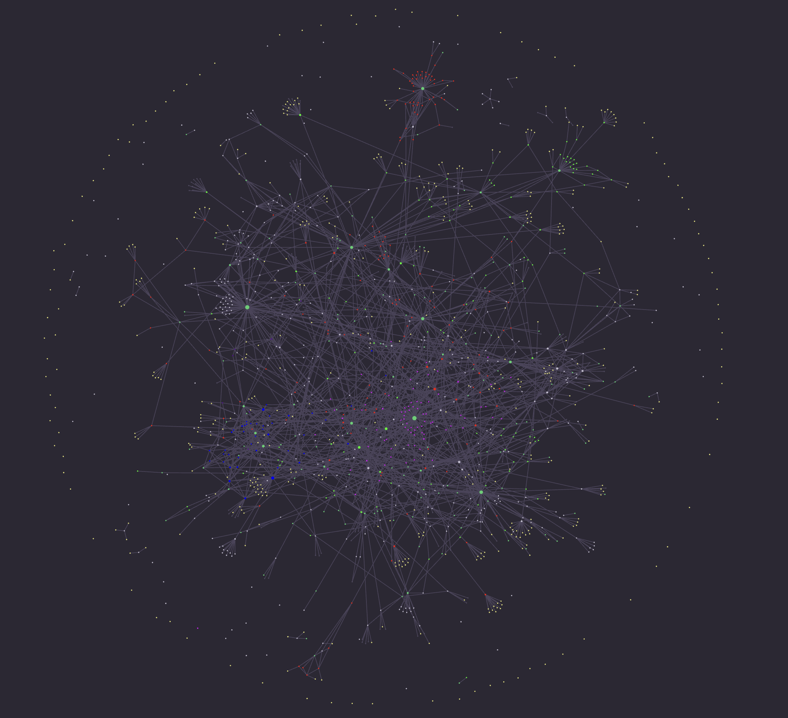

## Mind Map

Unsure if this is where I am supposed to put the mind map, but I have created something of the sort over my time using **Obsidian**.

Graph view of my notes in Obsidian:

Where:

- **Red nodes** represent math notes
- **Blue nodes** represent computational neuroscience notes
- **Green nodes** represent computer science notes
- **Purple nodes** represent daily notes
